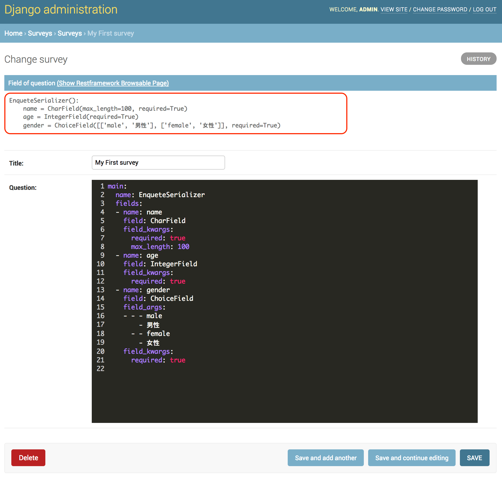
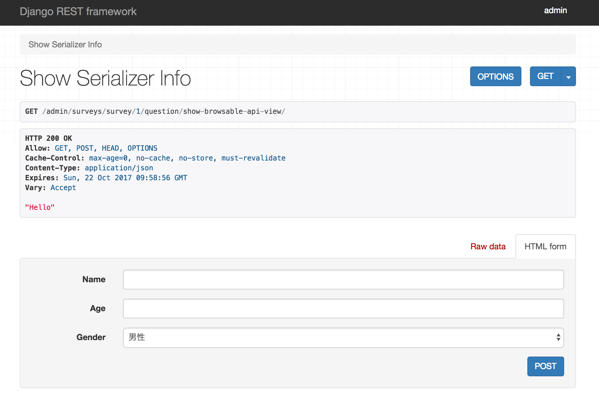
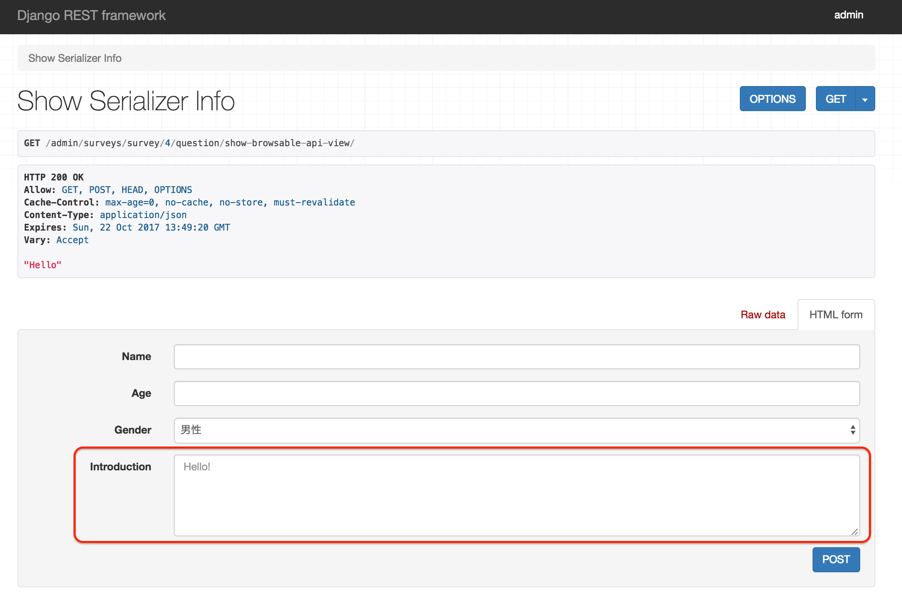
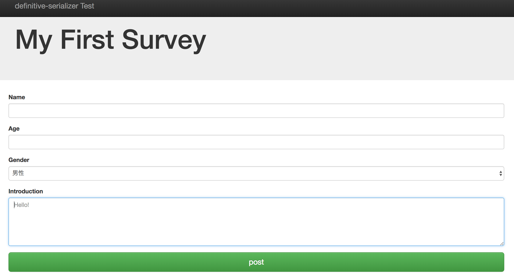
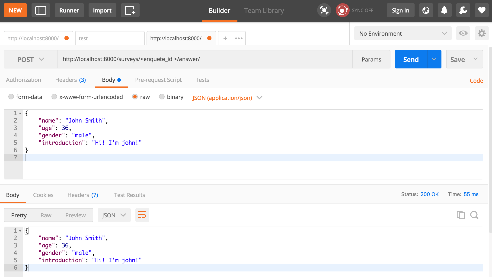

.. _example_project:

==============================================================================
プロジェクトにdefinable-serializerを組み込む
==============================================================================

definable-serializerの一番の目的は、シリアライザーの入力項目の変更を容易にし、デプロイ作業からエンジニアを守ることです。
故にシリアライザーの定義をファイルに書いては意味がありません。

その問題を解決する一番の方法はWebインターフェイスです。ウェブインターフェイスからシリアライザーの定義を変更することができれば、デプロイを行わずに済みます。
我々はrestframeworkを利用している時点でdjangoを利用しており、djangoはadminサイトにてモデルの追加/変更を簡単に行うことができます。

これを利用してモデルにシリアライザー定義用のフィールドを追加すれば簡単に定義を変更することができます。

definable-serializerではシリアライザー定義を扱うためのモデルフィールドを提供しています。

------------------------------------------------------------------------------

シリアライザーを定義するためのモデルフィールド
~~~~~~~~~~~~~~~~~~~~~~~~~~~~~~~~~~~~~~~~~~~~~~~~~~~~~~~~~~~

definable-serializerではモデルにてYAML/JSONでシリアライザー定義を扱うための
:ref:`definable_serializer_by_yaml_field_class` と :ref:`definable_serializer_by_json_field_class` というモデルフィールドを用意しています。

これらのフィールドを利用すると、adminサイト中にCodeMirror2を使ったテキストエリアが現れます。

さらにadminサイト中で記述されたシリアライザーの :ref:`definable_serializer_admin_class` クラスを提供しています。
ここでは簡単なプロジェクトを作成し、definable-serializerの組み込み例を紹介します。

------------------------------------------------------------------------------

アンケートシステムを作成してadmin画面でシリアライザーを定義する
~~~~~~~~~~~~~~~~~~~~~~~~~~~~~~~~~~~~~~~~~~~~~~~~~~~~~~~~~~~~~~~~~~~~~~~~~~~~~~
簡単なアンケート(Survey)を取るためのシステムがあるとします。

しかしこのアンケートシステムの営業担当は顧客に対して寛容な心を持ち、顧客の要望全てに答えようとしてしまいます。
担当のエンジニアは変更のたびにモデルフィールドの追加/削除を求められ、挙句の果てにラベルやヘルプテキストの変更などありとあらゆる要望に答えならなくなったとします。

**そんなときこそdefinable-serializerが真価を発揮します。**

ここではアンケートをとるためのプロジェクトを作成し、definable-serializeの組み込み方を説明します。

.. warning::

    ここではある程度djangoとrestframeworkの扱いを知っている方を対象とします。
    また、:ref:`install` を読んでいない方は先に読んで準備を整えてください。

    この説明中で記載するコードは完全に動作するものではありません。実際に動作するものを確認したい場合は、
    `完全に動作するサンプルプロジェクトを用意しています。 <https://github.com/salexkidd/restframework-definable-serializer-example>`_
    ので、そちらを参照してください。

exampleプロジェクトとsurveysアプリケーションの作成
++++++++++++++++++++++++++++++++++++++++++++++++++++++++++++++++++++++++++++++

適当なディレクトリ上で以下のコマンドを実行し、exampleプロジェクトとsurveysアプリケーションを作成します。

.. code-block:: shell

    $ django-admin.py startproject example_projecet
    $ cd ./example_projecet
    $ ./manage.py startapp surveys

次に ``settings.py`` 中の ``INSTALLED_APPS`` を変更します。

.. code-block:: python

    INSTALLED_APPS = (
        ...
        'rest_framework',
        'codemirror2',
        'definable_serializer',
        'surveys',
    )

surveysのmodels.pyとadmin.pyの変更
++++++++++++++++++++++++++++++++++++++++++++++++++++++++++++++++++++++++++++++

``models.py`` では質問を取り扱う ``Survey`` モデルと、回答データを扱うための ``Answer`` モデルを用意します。

Surveyモデル
    Surveyモデルには先ほど紹介した :ref:`definable_serializer_by_yaml_field_class` を利用して質問用のシリアライザー定義を取り扱う ``question`` フィールドと、
    アンケートタイトルを扱う ``title`` フィールドを追加します。

Answerモデル
    Answerモデルには回答対象へリレーションを張るための ``survey`` フィールドと、
    回答データを保持する ``answer`` フィールドを追加します。

``admin.py`` ではSurveyモデル、およびAnswerモデルをAdminサイトで確認できるように変更を行います。

models.pyを変更する
******************************************************************************

*surveys/models.py* を変更します。

Surveyモデルは、``models.Model`` ではなく :ref:`abstract_definitive_serializer_model_class` を継承している点に注意してください。

.. code-block:: python

    # surveys/models.py
    from django.db import models
    from django.conf import settings
    from definable_serializer.models import (
        DefinableSerializerByYAMLField,
        AbstractDefinitiveSerializerModel,
    )
    from definable_serializer.models.compat import YAMLField

    class Survey(AbstractDefinitiveSerializerModel):
        title = models.CharField(
            null=False,
            blank=False,
            max_length=300,
        )

        # YAMLで定義されたシリアライザーを扱うフィールド
        question = DefinableSerializerByYAMLField()

        def __str__(self):
            return self.title

    class Answer(models.Model):
        survey = models.ForeignKey("Survey")

        respondent = models.ForeignKey(
            settings.AUTH_USER_MODEL,
            on_delete=models.CASCADE,
        )

        answer = YAMLField(
            null=False,
            blank=False,
            default={},
            verbose_name="answer data",
            help_text="answer data"
        )

        class Meta:
            unique_together = ("survey", "respondent",)

admin.pyを変更する
******************************************************************************

admin画面にsurveyモデル,及びAnswerモデルを確認/変更するページを表示するため、 *surveys/admin.py* を変更します。
SurveyAdminクラスは、admin.ModelAdminではなく、 :ref:`definable_serializer_admin_class` を継承している点に注意してください

.. code-block:: python

    # surveys/admin.py
    from django.contrib import admin
    from definable_serializer.admin import DefinableSerializerAdmin
    from surveys import models as surveys_models

    @admin.register(surveys_models.Survey)
    class SurveyAdmin(DefinableSerializerAdmin):
        list_display = ("id", "title",)
        list_display_links = ("id", "title",)

    @admin.register(surveys_models.Answer)
    class AnswerAdmin(admin.ModelAdmin):
        list_display = ("id", "survey", "respondent",)
        list_display_links = ("id", "survey",)

作業が完了するとadminサイトにSurveyモデルとAnsweモデルの変更を行うページが追加されます。

質問用のシリアライザー定義を記述する
******************************************************************************

adminサイトを確認するために開発用サーバーを起動します。初回起動のため、マイグレーション作業及びadminアカウントを作成した後に開発用サーバーを起動します。

.. code-block:: shell

    $ ./manage.py makemigrations
    ...

    $ ./manage.py migrate
    ...

    $ ./manage.py createsuperuser
    Username (leave blank to use 'your-name'): admin
    Email address: admin@example.com
    Password: <password>
    Password (again): <password>
    Superuser created successfully.

    $ ./manage.py runserver 0.0.0.0:8000
    Django version 1.11.6, using settings 'example_project.settings'
    Starting development server at http://0.0.0.0:8000/
    Quit the server with CONTROL-C.

起動したら `http://localhost:8000/admin/surveys/survey/add/survey <http://localhost:8000/admin/surveys/survey/add/>`_ をブラウザーで開いてSurveyモデルのadmin画面にアクセスしましょう。

タイトルとYAMLで記述されたシリアライザー定義を入力します。ここでは名前、年齢、性別の3つを扱う簡単なシリアライザーを定義します。
以下のYAMLデータをquestionのフィールドにコピー＆ペーストしてください。(タイトルは適当で構いません)

.. code-block:: yaml

    main:
      name: EnqueteSerializer
      fields:
      - name: name
        field: CharField
        field_kwargs:
          required: true
          max_length: 100
      - name: age
        field: IntegerField
        field_kwargs:
          required: true
      - name: gender
        field: ChoiceField
        field_args:
        - - - male
            - 男性
          - - female
            - 女性
        field_kwargs:
          required: true

入力が完了したら、[保存して編集を続ける]ボタンを押します。すると、編集画面の上部に定義したシリアライザーのクラス情報が表示されます。

    保存後に問題がなければシリアライザークラスの情報がページ上部に表示されます。

また、定義されたシリアライザーをrestframeworkのもつBrowsable APIのページを使って確認することもできます。

タイトルラインにある [Show Restframework Browsable Page] のリンクをクリックすると、
Browsable APIのページが開き、定義したシリアライザーの入力テストを行うことができます。

    Browsable APIで確認した例

シリアライザーを確認できたところで、次は定義を変更してみましょう。例として紹介文用のフィールド、 ``introduction`` を追加します。

.. code-block:: yaml

    main:
      name: EnqueteSerializer
      fields:

      ...

      - name: introduction
        field: definable_serializer.extra_fields.TextField
        field_args:
          required: true
          placeholder: Hello!

追加が完了したらモデルを保存して、再度 Browsable APIのページでシリアライザーの状態を確認してみましょう。
問題がなければ、テキストエリアが追加されます。

    定義が正しければテキストエリアが追加されます

次はユーザーがアンケートの回答および入力内容の変更/確認を行うビューを作成します。

------------------------------------------------------------------------------

ユーザーからの回答を受け付けるビューの作成
++++++++++++++++++++++++++++++++++++++++++++++++++++++++++++++++++++++++++++++

restframeworkを利用する場合、REST API経由でやり取りをするケースが多いと思いますが、
ここではrestframeworkが持つ ``TemplateHTMLRenderer`` も同時にサポートしてユーザーの回答用ビューを作成します。

このビューにおいて問題になるのが、Surveyモデルオブジェクト中のシリアライザー定義からシリアライザークラスを取り出す方法と、
POSTされた回答内容をどのように保存するかという点です。

definable-serializerではこれらの問題を解決するための方法を提供しています。

.. _`extract_serializer_by_model_field`:

モデルからシリアライザークラスを取り出す方法
******************************************************************************

シリアライザー定義用フィールドを持つモデルオブジェクトからシリアライザークラスを取り出すのはさほど難しくありません。

先ほど定義したSurveyモデルは　:ref:`abstract_definitive_serializer_model_class` を継承しており、
シリアライザークラスを取り出すためのメソッドである ``get_question_serializer_class`` がモデルオブジェクトに自動で追加されるからです。

例として先ほど作成したSurveyモデルオブジェクトから ``question`` フィールドに記述したシリアライザー定義の
シリアライザークラスを取り出します。

.. code-block:: python

    >>> from surveys import models as surveys_models
    >>> survey_obj = surveys_models.Survey.objects.get(pk=1)
    >>> question_serializer_class = survey_obj.get_question_serializer_class()
    >>> question_serializer = question_serializer_class()
    >>> print(question_serializer)
    EnqueteSerializer():
        name = CharField(max_length=100, required=True)
        age = IntegerField(required=True)
        gender = ChoiceField([['male', '男性'], ['female', '女性']], required=True)
        introduction = TextField(placeholder='Hello!', required=True)

.. hint::

    例えば ``foobar`` というモデルフィールドが
    :ref:`definable_serializer_by_yaml_field_class` または :ref:`definable_serializer_by_json_field_class` のどちらかを利用していたら、
    ``get_foobar_serializer_class`` というメソッド名でシリアライザークラスを取り出すことができます。
    (ただし、モデルが :ref:`abstract_definitive_serializer_model_class` を継承している場合のみに限ります)

.. _`storing-input-data`:

入力された内容を保存する方法
******************************************************************************

definable-serializerでは、シリアライザーのフィールドとモデルのフィールドを対にしないという理念のもと作られています。
そのためシリアライザーに渡されたユーザーからの入力内容は、モデルの単一のフィールドにJSON/YAML/Pickle等にシリアライズ(直列化)して保存する必要があります。

definable-serializerでは、ユーザーからの入力を保存するために :ref:`compat_json_field` と :ref:`compat_yaml_field` を用意しています。
先ほど作成したmodels.py中のAnswerモデルのanswerフィールドは :ref:`compat_yaml_field` を利用しています。

以下にAnswerモデルに追加したanswerフィールドにアンケートの内容を保存するためのコード例を示します。

.. code-block:: python

    # シリアライザークラスを作成してデータを渡し、バリデーションを行う
    >>> from surveys import models as surveys_models
    >>> survey_obj = surveys_models.Survey.objects.get(pk=1)
    >>> question_serializer_class = survey_obj.get_question_serializer_class()
    >>> question_serializer = question_serializer_class(data={
    ...     "name": "John Smith",
    ...     "age": 20,
    ...     "gender": "male",
    ...     "introduction": "Hi!"
    ... })
    >>> question_serializer.is_valid()
    True

    >>> from django.contrib.auth import get_user_model
    >>> admin_user = get_user_model().objects.get(pk=1)
    >>> print(admin_user)
    admin
    >>> answer_obj = surveys_models.Answer.objects.create(
    ...     survey=survey_obj,
    ...     respondent=admin_user,
    ...     answer=question_serializer.validated_data
    ... )
    >>> answer_obj.answer
    odict_values(['John Smith', 20, 'male', 'Hi!'])

実際に入れたデータをadminサイトで確認してみましょう。YAML形式で保存されていることが確認できます。

.. figure:: imgs/data_store_by_yaml.png

    `!!Ordered Mapping <http://yaml.org/type/omap.html>`_ で保存されていることが確認できます。

.. hint::
    例としてYAMLFieldを用いてバリデーション後の結果を保存しましたが、モデルフィールドさえ提供されていれば、色々な形式で保存することが出来ます。
    詳しくは :ref:`methods-of-storing-input-data` を参照してください

.. warning::

    保存したJSONデータを検索の対象としたい場合はdjangoの提供する
    ``django.contrib.postgres.fields.JSONField`` を利用することを強くおすすめします。
    ただし、そのままではいくつかの問題があります。詳しくは :ref:`json-field-problem` を御覧ください。

ユーザー回答用ビューの作成例
******************************************************************************

上の内容を踏まえて回答用ビューの作成例を示します。

.. warning::
    下記に示すコードは作成例です。
    urls.pyへの登録、テンプレートの用意、登録後のリダイレクト先が存在しない等の問題により、このままでは正しく動作しません。
    ここではそれらが完全に揃っていることにして説明を続けます。

    実際に動作するものを確認したい場合は
    `完全に動作するExampleプロジェクトを用意しています <https://github.com/salexkidd/restframework-definable-serializer-example>`_

.. code-block:: python

    from django.contrib import messages
    from django.http import HttpResponseRedirect
    from django.shortcuts import get_object_or_404

    from rest_framework.views import APIView
    from rest_framework.response import Response
    from rest_framework.renderers import TemplateHTMLRenderer, JSONRenderer
    from rest_framework.exceptions import MethodNotAllowed, NotFound
    from rest_framework.permissions import IsAuthenticated
    from rest_framework.authentication import (
        SessionAuthentication, TokenAuthentication
    )

    from . import models as surveys_models

    class Answer(APIView):
        """
        Answer API
        """
        allowed_methods = ("GET", "POST", "OPTIONS",)
        renderer_classes = (TemplateHTMLRenderer, JSONRenderer,)
        authentication_classes = (SessionAuthentication, TokenAuthentication,)
        permission_classes = (IsAuthenticated,)
        template_name = 'answer.html'

        def _get_previous_answer(self, survey):
            """
            過去の回答データを取得します。存在しない場合はNoneを返します
            """
            previous_answer = None
            try:
                previous_answer = surveys_models.Answer.objects.get(
                    respondent=self.request.user, survey=survey)
            except surveys_models.Answer.DoesNotExist:
                pass

            return previous_answer

        def initial(self, request, *args, **kwargs):
            super().initial(request, *args, **kwargs)
            survey = get_object_or_404(
                surveys_models.Survey, pk=kwargs.get('survey_pk'))
            self.previous_answer = self._get_previous_answer(survey)
            self.survey = getattr(self.previous_answer, "survey", None) or survey

        def get_serializer(self, *args, **kwargs):
            """
            質問用のシリアライザークラスを返します
            """
            return self.survey.get_question_serializer_class()(*args, **kwargs)

        def get(self, request, survey_pk, format=None):
            """
            Request HeaderのAcceptが "application/json" の場合はJSONRendererで
            過去の入力データを返します。回答がない場合は404を返します。

            Request HeaderのAcceptが "application/json" 以外の場合、質問の入力画面を表示します。
            ユーザーが過去に同じ質問に回答していた場合、回答データを復元して表示します。
            """
            response = None
            serializer = self.get_serializer()
            if self.previous_answer:
                serializer = self.get_serializer(data=self.previous_answer.answer)
                serializer.is_valid()

            if isinstance(self.request.accepted_renderer, TemplateHTMLRenderer):
                response = Response(
                    {'serializer': serializer, 'survey': self.survey})
            else:
                if not self.previous_answer:
                    raise NotFound()
                response = Response(serializer.data)

            return response

        def post(self, request, survey_pk):
            """
            回答データの投稿を受け付けます。入力内容に不備があった場合はそれぞれのレンダラーでエラーレスポンスを返します。

            回答データに問題がなく、TemplateHTMLRendererを利用する場合はトップ画面にリダイレクトします。
            JSONRendererの場合は成功レスポンスを返します。

            また、過去に投稿がない場合は新しくAnswerオブジェクトを作成し、投稿があった場合はAnswerオブジェクトを更新します。
            """
            response = None
            serializer = self.get_serializer(data=self.request.data)

            if isinstance(self.request.accepted_renderer, TemplateHTMLRenderer):
                response = HttpResponseRedirect("/")
                if not serializer.is_valid():
                    response = Response(
                        {'serializer': serializer, 'survey': self.survey})
                else:
                    messages.add_message(
                        request, messages.SUCCESS, 'Thank you for posting! 💖')
            else:
                serializer.is_valid(raise_exception=True)
                response = Response(serializer.data)

            if serializer.is_valid():
                if self.previous_answer:
                    self.previous_answer.answer = serializer.validated_data
                    self.previous_answer.save()
                else:
                    surveys_models.Answer.objects.create(
                        survey=self.survey,
                        respondent=request.user,
                        answer=serializer.validated_data
                    )

            return response

        def options(self, request, *args, **kwargs):
            """
            APIスキーマやその他のリソース情報を返します。
            ただし、Request HeaderのAcceptが "text/html"の場合は 405(Method Not Allowed)を返します。
            """
            if request.accepted_media_type == TemplateHTMLRenderer.media_type:
                raise MethodNotAllowed(
                    "It can not be used except when "
                    "it is content-type: application/json."
                )
            return super().options(request, *args, **kwargs)

------------------------------------------------------------------------------

回答用ビューのアクセス例
++++++++++++++++++++++++++++++++++++++++++++++++++++++++++++++++++++++++++++++

ブラウザーでレスポンスを得た場合
******************************************************************************

上記のビューにブラウザーからアクセスするとHTMLTemplateRendererにより、以下のようなレスポンスを返します。

    回答画面のイメージ

Postmanを用いてREST API経由のレスポンスを得た場合
******************************************************************************

`Chromeの機能拡張であるPostman <https://chrome.google.com/webstore/detail/postman/fhbjgbiflinjbdggehcddcbncdddomop?hl=ja>`_
を用いてREST API経由で回答を行った場合の例を示します。

.. warning::

    REST API経由でアクセスを行う場合は、Headersタブにて ``Accept``, ``Authorization``, ``Content-Type`` の3つを適切に指定してください。

    .. figure:: imgs/postman_with_headers.png

Postmanを用いてOPTIONSメソッドでレスポンスを得た場合
******************************************************************************

``OPTIONS`` メソッドでアクセスするとREST APIの詳細情報及びPOST時のJSONスキーマが表示されます。

以下にレスポンス例を示します。

.. code-block:: json

    {
        "name": "Answer",
        "description": "Answer API",
        "renders": [
            "text/html",
            "application/json"
        ],
        "parses": [
            "application/json",
            "application/x-www-form-urlencoded",
            "multipart/form-data"
        ],
        "actions": {
            "POST": {
                "name": {
                    "type": "string",
                    "required": true,
                    "read_only": false,
                    "label": "Name",
                    "max_length": 100
                },
                "age": {
                    "type": "integer",
                    "required": true,
                    "read_only": false,
                    "label": "Age"
                },
                "gender": {
                    "type": "choice",
                    "required": true,
                    "read_only": false,
                    "label": "Gender",
                    "choices": [
                        {
                            "value": "male",
                            "display_name": "男性"
                        },
                        {
                            "value": "female",
                            "display_name": "女性"
                        }
                    ]
                },
                "introduction": {
                    "type": "string",
                    "required": true,
                    "read_only": false,
                    "label": "Introduction"
                }
            }
        }
    }
