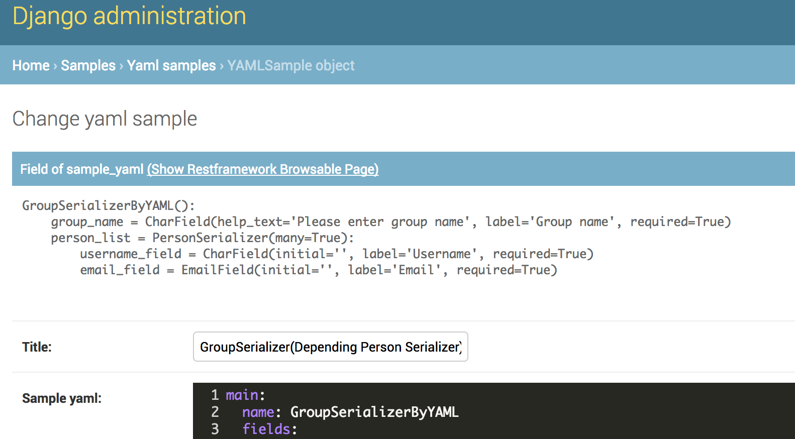

.. _`extend_modeladmin_class`:

==============================================================================
提供するモデルアドミンクラス
==============================================================================

JSONやYAMLで定義したシリアライザーは、実際にシリアライザークラスにしないと確認することができません。
:ref:`yaml-to-serializer` で説明した方法使ってdjango shellを使って確認することもできますが、
これでは入力のや見栄えのテストを行うのには不十分です。そのため、definable-serializerでは
``django.contrib.admin.ModelAdmin`` を拡張した
``definable_serializer.admin.DefinableSerializerAdmin`` クラスを提供しています。

DefinableSerializerAdmin
~~~~~~~~~~~~~~~~~~~~~~~~~~~~~~~~~~~~~~~~~~~~~~~~~~~~~~~~~~~~~~~~~~~~~~~~~~~~~~

.. class:: DefinableSerializerAdmin

DefinableSerializerAdminクラスでは以下の機能を提供します。

* 編集画面上部に定義されたシリアライザーのクラス情報を表示する機能
* restframeworkのもつBrowsable APIページを利用して定義されたシリアライザーを表示する機能

特にBrowsable APIページを利用して定義されたシリアライザーは入力のテストを行うことができるため、
非常に有用です。組み込み方も非常に簡単で、通常は ``admin.ModelAdmin`` を利用するところを
``DefinableSerializerAdmin`` に入れ替えるだけです。

以下に使用例を示します。

.. code-block:: python

    from django.contrib import admin
    from definable_serializer.admin import DefinableSerializerAdmin

    from . import models as surveys_models

    @admin.register(surveys_models.Survey)
    class SurveyAdmin(DefinableSerializerAdmin):

        list_display = (
            "id",
            "title",
        )

        list_display_links = (
            "id",
            "title",
        )

正しく組み込まれるとadmin画面が以下のようになります。

    画面上部にシリアライアーの定義が表示されます。
