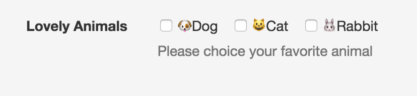
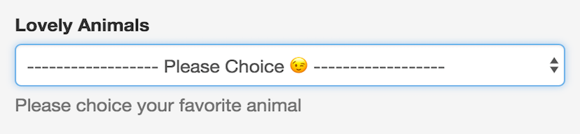
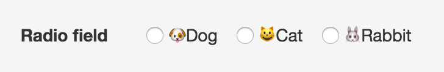
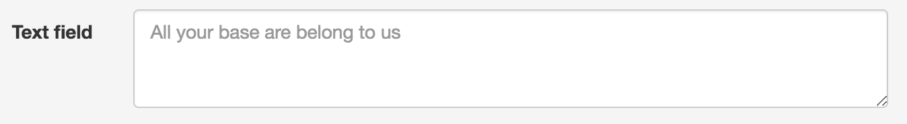

.. _`extra_serializer_fields`:

==============================================================================
提供するシリアライザーフィールドクラス
==============================================================================

Zen Of Pythonの *暗示するより明示するほうがいい* という観点からdefinable-serializerでは
**TemplateHTMLRenderer** のためにいくつかのフィールドを提供しています。

.. warning::

    将来的にこれらのフィールドは別パッケージとして提供をする可能性があります。

CheckRequiredField
++++++++++++++++++++++++++++++++++++++++++++++++++++++++++++++++++++++++++++++

必ずOnをしなければならないチェックボックスを提供します。ユーザーの意思や確認を行いたい場合に利用します。

fieldには ``definable_serializer.extra_fields.CheckRequiredField`` を指定します。

.. code-block:: yaml

    main:
      name: Agreement
      fields:
      - name: agreement
        field: definable_serializer.extra_fields.CheckRequiredField

MultipleCheckboxField
++++++++++++++++++++++++++++++++++++++++++++++++++++++++++++++++++++++++++++++

複数のチェックボックスによる選択肢を表示するフィールドを提供します。

fieldには ``definable_serializer.extra_fields.MultipleCheckboxField`` を指定します。

``required`` を ``true`` にすると必須入力になります。

``inline`` を ``true`` にするとチェックボックスが横並びに表示されます。

.. code-block:: yaml

    main:
      name: YourFavoriteAnimal
      fields:
      - name: animal_choice_field
        field: definable_serializer.extra_fields.MultipleCheckboxField
        field_args:
        - - - dog
            - 🐶Dog
          - - cat
            - 😺Cat
          - - rabbit
            - 🐰Rabbit
        field_kwargs:
          inline: true
          required: true
          label: Lovely Animals
          help_text: Please choice your favorite animal

    インライン化されたMultipleCheckboxField

ChoiceWithBlankField
++++++++++++++++++++++++++++++++++++++++++++++++++++++++++++++++++++++++++++++

渡されたchoicesの選択にブランクチョイスを自動的に追加します。ブランクチョイスが選択された状態でバリデーションが
行われるとエラーになります。

fieldには ``definable_serializer.extra_fields.ChoiceWithBlankField`` を指定します。

``blank_label`` に文字列を渡すとダッシュの連続の代わりにその文字列がブランクチョイスの部分に表示されます。

.. code-block:: yaml

    main:
      name: YourFavoriteAnimal
      fields:
      - name: animal_choice_field
        field: definable_serializer.extra_fields.ChoiceWithBlankField
        field_args:
        - - - dog
            - 🐶Dog
          - - cat
            - 😺Cat
          - - rabbit
            - 🐰Rabbit
        field_kwargs:
          label: Lovely Animals
          blank_label: '-------- Please Choice 😉 --------'
          help_text: Please choice your favorite animal

    blank_labelに文字を渡した例。blank_labelがからの場合は "---------" となります。

RadioField
++++++++++++++++++++++++++++++++++++++++++++++++++++++++++++++++++++++++++++++

ラジオボタンによる選択肢を表示するフィールドを提供します。

fieldには ``definable_serializer.extra_fields.RadioField`` を指定します。

``inline`` を ``true`` にするとチェックボックスが横並びに表示されます。

.. code-block:: yaml

    main:
      name: YourFavoriteAnimal
      fields:
      - name: animal_choice_field
        field: definable_serializer.extra_fields.RadioField
        field_args:
        - - - dog
            - 🐶Dog
          - - cat
            - 😺Cat
          - - rabbit
            - 🐰Rabbit
        field_kwargs:
          inline: true
          required: true

    インライン化されたRadioField

TextField
++++++++++++++++++++++++++++++++++++++++++++++++++++++++++++++++++++++++++++++

テキストエリアを提供します。

fieldには ``definable_serializer.extra_fields.TextField`` を指定します。

``rows`` に数値を渡すことででテキストエリアの行数を指定することができます。

``placeholder`` に文字列を渡すとプレースホルダー文字列を表示することができます。

    placeholderとrowsを設定した例
