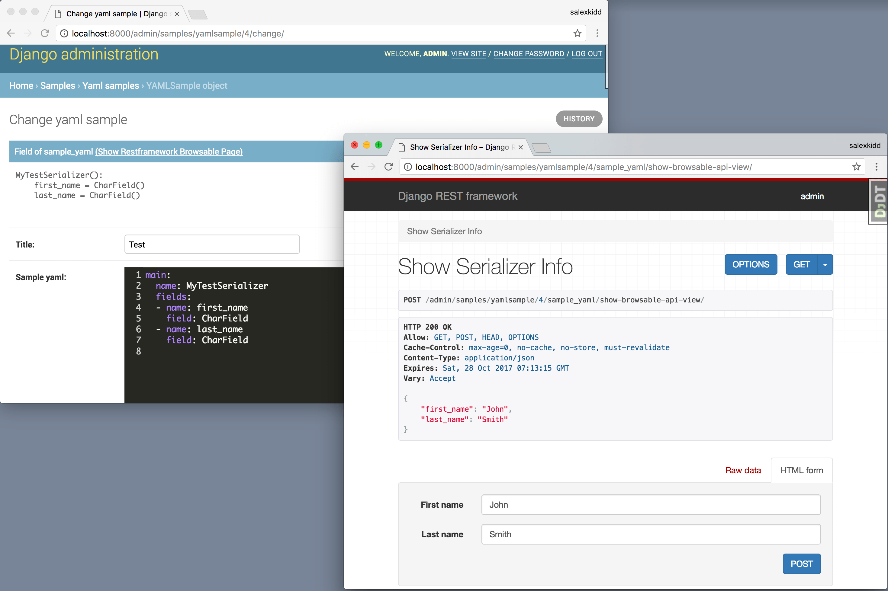

.. _`first`:

==============================================================================
restframework-definable-serializerとは
==============================================================================

概要
~~~~~~~~~~~~~~~~~~~~~~~~~~~~~~~~~~~~~~~~~~~~~~~~~~~~~~~~~~~~~~~~~~~~~~~~~~~~~~

django-restframework(以下restframework)のもつ、djangoモデル(以下モデル)からシリアライザーを生成できるモデルシリアライザーはとても強力です。
このおかげでシリアライザー用のコードを書く手間を省くことができます。

しかしモデルシリアライザーから作成したシリアライザーのフィールド変更は、即ちモデルのフィールドを変更と同義です。ひとたび変更が発生すれば、デプロイとマイグレーション作業を行わなければなりません。

しかもマイグレーションを伴うデプロイはひと気がない深夜に行わなければならない場合が多く、これが続くとエンジニアは辟易してしまいます。

例えば名前、年齢、性別だけを扱うアンケートがあるとしましょう。
最初はこれでよかったはずが、顧客からの要望で入力項目がどんどんと増えていき、最後にはかなりの項目数になっていた…。
筆者はこれに近い経験をしたことがあります。これは非常に苦痛でした。

この経験から学べることは **変更が多く発生するシリアライザーはモデルシリアライザーから作成してはいけない** ということです。

シリアライザーのフィールドとモデルのフィールドが対になっているが故に、シリアライザーのフィールドが変更されるたびにモデルの変更が発生してしまうのです。

この問題を解決するには **手軽に変更可能な定義からシリアライザーを動的に作る** ことです。

definable-serializerは、YAML/JSON(ファイル/文字列)からシリアライザーを作ることができます。

また、シリアライザーの定義を行うためのモデルフィールドや、ユーザーからの入力情報を保存するフィールドなども提供しています。

------------------------------------------------------------------------------

definable-serializerができること
~~~~~~~~~~~~~~~~~~~~~~~~~~~~~~~~~~~~~~~~~~~~~~~~~~~~~~~~~~~~~~~~~~~~~~~~~~~~~~

definable-serializerは以下のような機能を備えています。

- YAML/JSON(ファイル/文字列)からdjango-restframeworkで利用可能なシリアライザーを作成する機能を提供します
- adminサイトでシリアライザーを定義するためのモデルフィールドと、記述されたシリアライザーを確認する機能を提供します
- ユーザーからの入力を保存するためのモデルフィールドを提供します
- TemplateHTMLRendererを利用する際に便利なシリアライザーフィールドを提供します(将来的に分離予定です)

文字列やファイルからシリアライザーを作ることもできますが、特にadmin画面でシリアライザーの定義が記述されることを期待しています。

    adminサイトで記述したシリアライザー定義と確認

------------------------------------------------------------------------------

シリアライザー定義の記述例
~~~~~~~~~~~~~~~~~~~~~~~~~~~~~~~~~~~~~~~~~~~~~~~~~~~~~~~~~~~~~~~~~~~~~~~~~~~~~~

以下にYAMLで定義した簡単なシリアライザーの例を紹介します。

.. code-block:: yaml

    main:
      name: EnqueteSerializer
      fields:
      - name: name
        field: CharField
        field_kwargs:
          required: true
          max_length: 100
      - name: age
        field: IntegerField
        field_kwargs:
          required: true
      - name: gender
        field: ChoiceField
        field_args:
        - - - male
            - 男性
          - - female
            - 女性
        field_kwargs:
          required: true

上の定義は名前、年齢、性別の3つの入力を持つシリアライザーの例です。
この定義をdefinable-serializerを用いてシリアライザー化すると以下のようになります。

.. code-block:: python

    EnqueteSerializer():
        name = CharField(max_length=100, required=True)
        age = IntegerField(required=True)
        gender = ChoiceField([['male', '男性'], ['female', '女性']], required=True)

これをrestframeworkの持つBrowsableAPIRendererで表示すると以下の様になります。

.. figure:: imgs/browse_enquete_serializer.png

    BrowsableAPIRendererで表示した例

------------------------------------------------------------------------------

.. _`yaml-to-serializer`:

YAMLで記述された定義からシリアライザーを作成する
~~~~~~~~~~~~~~~~~~~~~~~~~~~~~~~~~~~~~~~~~~~~~~~~~~~~~~~~~~~~~~~~~~~~~~~~~~~~~~
実際にYAMLデータから名前を扱う簡単なシリアライザーを作成し、データを入力してバリデーションを行います。

djangoシェルを立ち上げて以下のように打ち込んでみましょう。::

    ./manage.py shell

djangoのシェルが立ち上がったら以下のコードを実行してみましょう

.. code-block:: python

    >>> from definable_serializer.serializers import build_serializer_by_yaml

    # 名前だけを扱うシリアライザーのYAML定義
    >>> YAML_DEFINE_DATA = """
    ... main:
    ...   name: YourFirstSerializer
    ...   fields:
    ...   - name: name
    ...     field: CharField
    ...     field_kwargs:
    ...       required: true
    ...       max_length: 100
    ... """

    # シリアライザー化
    >>> serializer_class = build_serializer_by_yaml(YAML_DEFINE_DATA)
    >>> serializer_class()
    FirstSerializer():
        name = CharField(max_length=100, required=True)

    # バリデーション成功例
    >>> serializer = serializer_class(data={"name": "Taro Yamada"})
    >>> serializer.is_valid()
    >>> serializer.validated_data
    OrderedDict([('name', 'Taro Yamada')])

    # バリデーションエラー例(空の場合)
    >>> serializer = serializer_class(data={"name": ""})
    >>> serializer.is_valid()
    False
    >>> serializer.errors
    {'name': ['This field may not be blank.']}

    # バリデーションエラー例(100文字を超えていた場合 )
    >>> serializer = serializer_class(data={"name": "a" * 101})
    >>> serializer.is_valid()
    False
    >>> serializer.errors
    {'name': ['Ensure this field has no more than 100 characters.']}

このように、YAMLで記述された定義からシリアライザーを作成することができました。
次はアンケートを扱うexampleアプリケーションを作成し、definable-serializerをadminサイトへを組み込む例を紹介するとともに、ユーザー側のビューを作成する例も紹介します。
