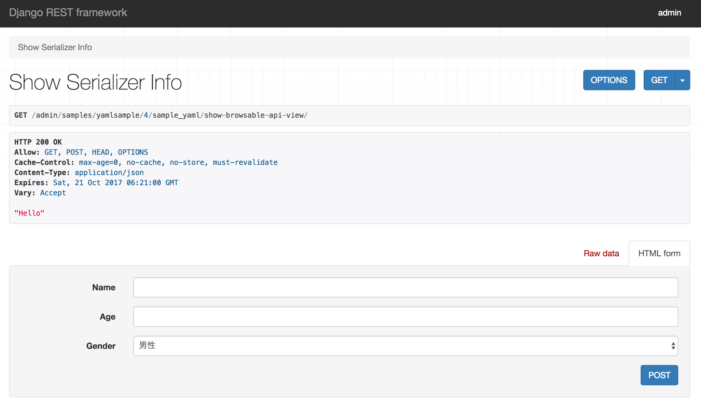

==============================================================================
はじめに
==============================================================================

.. _`first`:

restframework-definitive-serializerとは
~~~~~~~~~~~~~~~~~~~~~~~~~~~~~~~~~~~~~~~~~~~~~~~~~~~~~~~~

django-restframework(以下restframework)のもつ、モデルからシリアライザーを生成できる
*モデルシリアライザー* はとても強力な機能です。
ユーザーからの入力を受け付けるシリアライザーをモデルから生成することができるため、大幅に手間を省くことができます。

しかし入力フィールドの変更は即ちモデルの変更となり、この時点でサーバーへのデプロイ、マイグレーション、テストという
一連の作業を行わなければならないことが決定されます。大抵の場合、マイグレーションを伴うメンテナンスは
人気のない深夜に作業を行わなければならないため、非常に面倒です。

例えば、アンケートを扱うモデルがあるとしましょう。
最初は名前、年齢、性別の3つを扱うものだったはずが、
顧客からの要望で入力フィールドがどんどんと増えていき、最後にはかなりのフィールド数になっていた・・

これに近い経験をしたことがある人もいるのではないでしょうか。

これで学べることは、フィールドの変更が多く発生するようなシリアライザーを作る場合は、
モデルシリアライザー利用するべきではないということです。
もっというと、 **シリアライザーの入力フィールドとモデルのフィールドを対にしてはいけない** ということです。

しかし、この問題は通常のシリアライザーを利用して入力フィールドを定義したとしても、デプロイの手間を無くすことは出来ません。
この問題を解決するには **手軽に変更可能なデータから動的にシリアライザー** を作ることです。

restframework-definitive-serializer(以下definitive-serializer)は、シリアライザーの定義が記述されたYAMLやJSONを読み込み、
シリアライザーを動的に作成することが出来ます。

シリアライザー定義の記述例
~~~~~~~~~~~~~~~~~~~~~~~~~~~~~~~~~~~

以下にYAMLで定義した簡単なシリアライザーの例を紹介します。

.. code-block:: yaml

    main:
      name: EnqueteSerializer
      fields:
      - name: name
        field: CharField
        field_kwargs:
          required: true
          max_length: 100
      - name: age
        field: IntegerField
        field_kwargs:
          required: true
      - name: gender
        field: ChoiceField
        field_args:
        - - - male
            - 男性
          - - female
            - 女性
        field_kwargs:
          required: true

上の定義は名前、年齢、性別の3つの入力を持つシリアライザーの例です。
この定義をdefinitive-serializerを用いてシリアライザー化すると以下のようになります。

.. code-block:: python

    EnqueteSerializer():
        name = CharField(max_length=100, required=True)
        age = IntegerField(required=True)
        gender = ChoiceField([['male', '男性'], ['female', '女性']], required=True)

これをrestframeworkの持つBrowsableAPIRendererで表示すると以下の様になります。

    BrowsableAPIRendererで表示した例

次の章ではdefinitive-serializerで作成可能なシリアライザーの定義例を示します。
