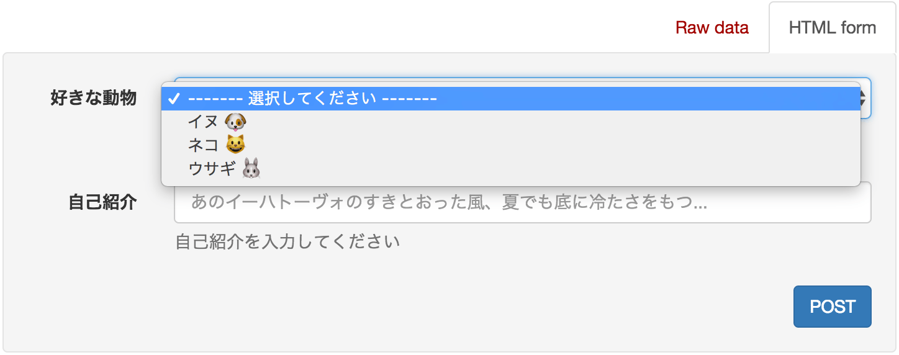
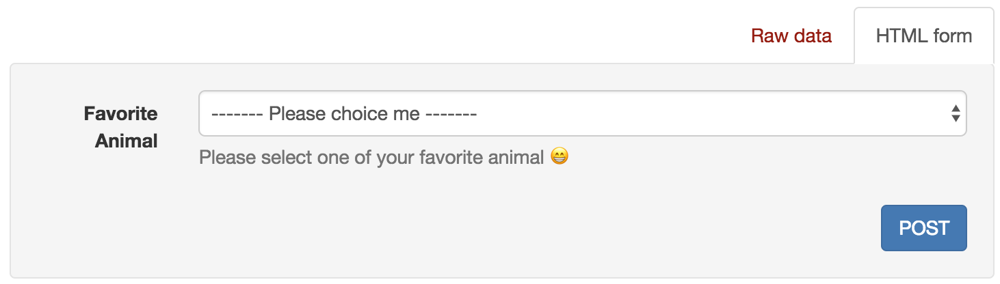
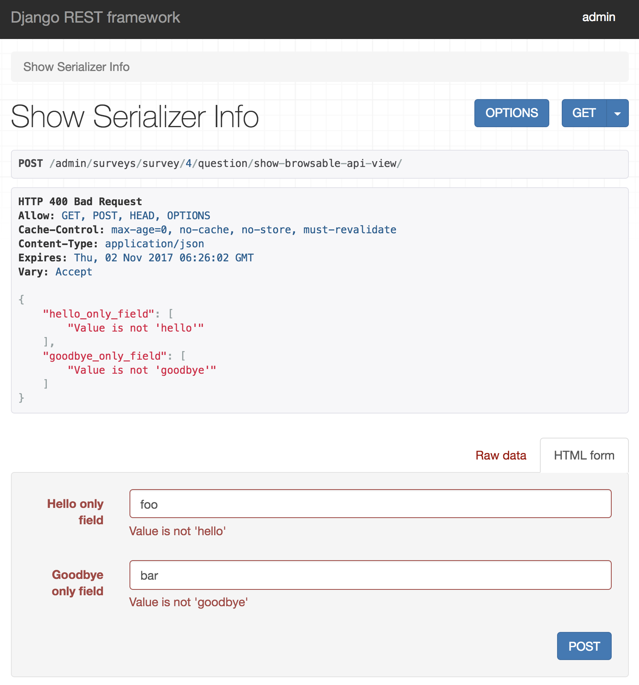

.. _`how_to_define_serializer`:

==============================================================================
シリアライザーの定義方法
==============================================================================

restframeworkのシリアライザーは、システムからの出力とユーザーからの入力を適切に処理するために存在します。
これはdjangoのフォームと変わりません。しかし、djangoの提供するフォームはネストした複雑なデータの取り扱いには向いていません。

それに比べ、restframeworkのシリアライザーはネストされたデータも上手に扱うことができるため、djangoのformよりもパワフルです。
djangoのフォームも、formsets等を利用して複数のフォームを並べることもできますが、UI/UXの観点からみると絶望的な状況になるでしょう。

ここではdefinable-serializerを用いて単純なシリアライザーと、ネストされたシリアライザーをYAMLで定義する方法を解説します。

またシリアライザーが持つフィールドの記述方法と、validateメソッドを含むシリアライザーの記述方法についても解説します。

------------------------------------------------------------------------------

単純なシリアライザーとネストされたシリアライザー
~~~~~~~~~~~~~~~~~~~~~~~~~~~~~~~~~~~~~~~~~~~~~~~~~~~~~~~~~~~~~~~~~~~~~~~~~~~~~~

単純なシリアライザー
++++++++++++++++++++++++++++++++++++++++++++++++++++++++++++++++++++++++++++++

単純なシリアライザーとは、フィールド中に別のシリアライザーをネストしていないものを指します。
例えばファーストネームとラストネームのみを扱うような構造のシリアライザーの場合は以下のように記述します。

.. code-block:: yaml

    main:
      name: NameEntry
      fields:
      - name: first_name
        field: CharField
        field_kwargs:
          required: true
          max_length: 100

      - name: last_name
        field: CharField
        field_kwargs:
          required: true
          max_length: 100

この定義をシリアライザークラス化すると以下のようになります。

.. code-block:: python

    NameEntry():
        first_name = CharField(max_length=100, required=True)
        last_name = CharField(max_length=100, required=True)

このシリアライザーに渡せるデータは以下のような形式になります。

.. code-block:: json

    {
        "first_name": "John",
        "last_name": "Smith",
    }

ネストされたシリアライザー
++++++++++++++++++++++++++++++++++++++++++++++++++++++++++++++++++++++++++++++

ネストされたシリアライザーとは、シリアライザー中に他のシリアライザーを含むものを指します。
例えばSNSのようにグループに人を紐付けるような構造のシリアライザーがそれにあたります。

以下の記述例を示します。

.. code-block:: yaml

    main:
      name: Group
      fields:
      - name: group_name
        field: CharField
        field_kwargs:
          label: Group name
          required: true

      - name: persons
        field: Person
        field_kwargs:
          many: true

    depending_serializers:
    - name: Person
      fields:
      - name: first_name
        field: CharField
        field_kwargs:
          required: true

      - name: last_name
        field: CharField
        field_kwargs:
          required: true

この定義をシリアライザークラス化すると以下のようになります。

.. code-block:: python

    Group():
        group_name = CharField(label='Group name', required=True)
        persons = Person(many=True):
            first_name = CharField(required=True)
            last_name = CharField(required=True)

このシリアライザーに渡せるデータは以下のような形式になります(Persons部分がネストされたシリアライザーになります)。

.. code-block:: JSON

    {
        "group_name": "My dearest friends",
        "persons": [
            {"first_name": "John", "last_name": "Smith"},
            {"first_name": "Taro", "last_name": "Yamada"}
        ]
    }

ここで注目するべきは、定義中の ``depending_serializers`` の項目です。
この項目は、mainのシリアライザーを作成する前に予め作成されるシリアライザークラスのリストになります。

``depending_serializers`` 中で先にシリアライザーの定義がされていれば、後に記述されるシリアライザーはそれらを利用することができます。

.. code-block:: yaml

    main:
      name: YourFavorite
      fields:
      - name: foods_and_animal
        field: FoodsAndAnimals
        field_kwargs:
          many: true

    depending_serializers:
    - name: Animal
      fields:
      - name: name
        field: CharField
    - name: Food
      fields:
      - name: name
        field: CharField
    - name: FoodsAndAnimals
      fields:
      - name: animals
        field: Animal   # 上で定義されているAnimalを利用しています
        field_kwargs:
          many: true
      - name: foods     # 上で定義されているFoodを利用しています
        field: Food
        field_kwargs:
          many: true

この定義をシリアライザークラス化すると以下のようになります。

.. code-block:: python

    YourFavorite():
        foods_and_animal = FoodsAndAnimals(many=True):
            animals = Animal(many=True):
                name = CharField()
            foods = Food(many=True):
                name = CharField()

------------------------------------------------------------------------------

シリアライザーフィールドの記述方法
~~~~~~~~~~~~~~~~~~~~~~~~~~~~~~~~~~~~~~~~~~~~~~~~~~~~~~~~~~~~~~~~~~~~~~~~~~~~~~

シリアライザーにはフィールドが必要です。フィールドを記述するにはフィールド名とフィールドタイプを必ず指定します。
任意でフィールドの引数、名前付き引数を指定することができます。以下にフィールドの記述例を示します。

.. code-block:: yaml

    - name: gender          # フィールド名
      field: ChoiceField    # フィールドタイプ(フィールドクラス名)
      field_args:           # フィールドタイプの引数(list)
      - - - male
          - 男性
        - - female
          - 女性
      field_kwargs:         # フィールドタイプの名前付き引数(dict)
        required: true
        label: 性別を入力してください

上記の定義は以下のPythonコードと同義になります。

.. code-block:: python

    >>> from rest_framework import serializers
    >>> gender = serializers.ChoiceField(
    ...     [["male", "男性"], ["female", "女性"]],
    ...     required=True,
    ...     label="性別を入力してください"
    ... )
    >>> gender
    ChoiceField([['male', '男性'], ['female', '女性']], label='性別を入力してください', required=True)

restframeworkが提供するシリアライザーフィールドの利用
++++++++++++++++++++++++++++++++++++++++++++++++++++++++++++++++++++++++++++++

.. warning::

    definable-serializerでは ``DictField``, ``ListField`` 及び ``SerializerMethodField``
    以外のシリアライザーフィールドが利用可能です。(これらのフィールドは将来的にサポートされる予定です)

definable-serializerではrestframeworkが提供するほとんどのシリアライザーフィールドを利用することができます。
シリアライザーフィールドの一覧については
`restframeworkのシリアライザーフィールドのページを参照してください <http://www.django-rest-framework.org/api-guide/fields/#serializer-fields>`_

restframeworkが提供するシリアライザーフィールドを利用する場合はクラス名だけを指定します。

.. code-block:: python

    - name: my_checkbox    # フィールド名
      field: BooleanField  # フィールドタイプ

    - name: my_char        # フィールド名
      field: CharField     # フィールドタイプ

    - name: my_regex_field # フィールド名
      field: RegexField    # フィールドタイプ
      field_args:
      - a-zA-Z0-9

サードパーティパッケージが提供するシリアライザーフィールドの利用
++++++++++++++++++++++++++++++++++++++++++++++++++++++++++++++++++++++++++++++

definable-serializerではサードパーティパッケージ、つまりrestframework以外が提供するシリアライザーフィールドも利用可能です。
利用する場合は、各フィールド定義の ``field`` 項目 に ``<パッケージ名>.<モジュール名>.<クラス名>`` の形式で指定します。

.. code-block:: yaml

    main:
      name: AgreementSerailizer
      fields:
      - name: agreement
        field: definable_serializer.extra_fields.CheckRequiredField # サードパッケージが利用するシリアライザーフィールド
        field_kwargs:
          initial: false

この定義をシリアライザークラス化すると以下のようになります。

.. code-block:: python

    IncludeExtraSerializerField():
        agreement = CheckRequiredField()

.. hint::

    definable-serializerでは TemplateHTMLRendererに向けて、いくつかのシリアライザーフィールドを提供しています。
    :ref:`extra_serializer_fields` を御覧ください

.. _`field_i18n`:

フィールドの国際化
++++++++++++++++++++++++++++++++++++++++++++++++++++++++++++++++++++++++++++++

**0.1.12で登場しました**

djangoは国際化機構を提供しているため、システム全体の翻訳を行うことが可能です。

しかしこの機構はgettextを利用するため、コンパイルされた翻訳ファイルをサーバーにデプロイする必要があります。
definable-serializerの目的はデプロイの手間を減らすことなので、残念ながらこの方法は利用できません。

そのため ``label``, ``help_text``, ``choices`` にlocaleと翻訳テキストを対にした辞書を指定します。
また各フィールドのstyle引数がplaceholderを持つ場合、翻訳の辞書を指定することができます。

指定された翻訳テキストはリクエストオブジェクトに含まれる ``request.LANGUAGE_CODE`` を元に取り出され、シリアライザークラスをオブジェクト化する際に利用されます。

また、locale情報に対応するキーが存在しない場合は ``default`` キーにフォールバックするため、必ず指定する必要があります。

.. warning::

    locale情報の取得にはdjangoが提供するLocaleMiddlewareを利用する必要があります。
    settings.pyの ``MIDDLEWARE`` に ``django.middleware.locale.LocaleMiddleware`` を追加してください。
    詳しくは `Translation <https://docs.djangoproject.com/en/1.11/topics/i18n/translation/>`_ を参照してください

以下に翻訳テキストを含めたシリアライザーの定義例を示します。

.. code-block:: yaml

    main:
      name: I18NTest
      fields:
      - name: animal_field
        field: ChoiceField
        field_args:
        - - -
            - default: '------- Please choice me -------'
              ja: '------- 選択してください -------'
          - - dog
            - default: Dog 🐶
              ja: イヌ 🐶
          - - cat
            - default: Cat 😺
              ja: ネコ 😺
          - - rabbit
            - default: Rabbit 🐰
              ja: ウサギ 🐰
        field_kwargs:
          help_text:
            default: Please select one of your favorite animal 😁
            ja: 好きな動物を選んでね 😁
          label:
            default: Favorite Animal
            ja: 好きな動物

国際化が正しく行われたかを確認するためには、ブラウザーのAccept-languageを変更する必要があります。
もし、あなたがChromeを利用している場合は `Quick Language Switcher <https://chrome.google.com/webstore/detail/quick-language-switcher/pmjbhfmaphnpbehdanbjphdcniaelfie>`_ の利用をおすすめします。

    ユーザーのlocaleがjaの場合

    ユーザーのlocaleが存在しなかった場合

------------------------------------------------------------------------------

validateメソッドを含んだシリアライザー
~~~~~~~~~~~~~~~~~~~~~~~~~~~~~~~~~~~~~~~~~~~~~~~~~~~~~~~~~~~~~~~~~~~~~~~~~~~~~~
シリアライザーやシリアライザーフィールドにはカスタムされたvalidate用のメソッドを必要とする場合があります。
これらはPythonのコードを記述する必要があります。

definable-serializerではフィールド、シリアライザーともにvalidateメソッドを記述することできます。

.. warning::

    シリアライザーの定義中にvalidateメソッドを記述できることは便利な半面、危険を伴います。
    例えば、シリアライザーの定義を一般のユーザーに記述させたい要望があったとします。
    もし、一般ユーザーがvalidateメソッド中にシンタックスエラーを含む内容を記述してしまうと、エラーでクラッシュしてしまいます。

    また悪意のあるコードを書かれてしまうと、素直にそれが実行されてしまいます！

    もし、一般ユーザーにシリアライザーを記述させたい場合は、 ``allow_validate_method`` オプションを ``False`` にして
    **validateメソッドの記述を不許可にすることを強く推奨します。** 詳しくは以下を御覧ください。

    - :ref:`definable_serializer_by_yaml_field_class`
    - :ref:`definable_serializer_by_json_field_class`
    - :ref:`utility_functions`

フィールドのvalidateメソッド
++++++++++++++++++++++++++++++++++++++++++++++++++++++++++++++++++++++++++++++
フィールドにvalidateメソッドを追加するには以下のように記述します。

.. code-block:: yaml

    main:
      name: FieldValidationTestSerializer
      fields:
        - name: test_field_one
          field: CharField
          field_kwargs:
            required: true

          # Field validation method
          validate_method: |
            def validate_method(self, value):
                from rest_framework import serializers
                if value != "correct_data":
                    raise serializers.ValidationError("Please input 'correct_data'")
                return value

以下にバリデーションの結果を示します。

.. code-block:: python

    >>> from definable_serializer.serializers import build_serializer_by_yaml
    >>> YAML_DEFINE_DATA = """<< FieldValidationTestSerializer YAML DATA >>"""
    >>> serializer_class = build_serializer_by_yaml(YAML_DEFINE_DATA)
    >>> serializer = serializer_class(data={"test_field_one": "test"})

    # フィールドバリデーションエラー例
    >>> serializer.is_valid()
    False
    >>> serializer.errors
    ReturnDict([('test_field_one', ["Please input 'correct_data'"])])

    # フィールドバリデーション成功例
    >>> serializer = serializer_class(data={"test_field_one": "correct_data"})
    >>> serializer.is_valid()
    True

シリアライザーのvalidateメソッド
++++++++++++++++++++++++++++++++++++++++++++++++++++++++++++++++++++++++++++++

パスワードの確認フィールドのように、他のフィールドの入力データを利用する場合はシリアライザーのvalidateメソッドを記述する必要があります。

そのような必要がある場合は以下のように記述します。

.. code-block:: yaml

    main:
      name: PasswordTestSerializer
      fields:
      - name: password
        field: CharField
        field_kwargs:
          required: true
      - name: password_confirm
        field: CharField
        field_kwargs:
          required: true

      # Serializer  validation method
      serializer_validate_method: |-
        def validate_method(self, data):
            from rest_framework import serializers

            if data["password"] != data["password_confirm"]:
                raise serializers.ValidationError({
                    "password_confirm": "The two password fields didn't match.'."
                })
            return data

以下にバリデーションの結果を示します。

.. code-block:: python

    >>> from definable_serializer.serializers import build_serializer_by_yaml
    >>> YAML_DEFINE_DATA = """<< PasswordTestSerializer YAML DATA >>"""
    >>> serializer_class = build_serializer_by_yaml(YAML_DEFINE_DATA)

    # バリデーションエラー例
    >>> serializer = serializer_class(
    ...    data={"password": "new_password", "password_confirm": "foobar"})
    ...
    >>> serializer.is_valid()
    False

    >>> serializer.errors
    ReturnDict([('password_confirm',
                 ["The two password fields didn't match."])])

    # バリデーション成功例
    >>> serializer = serializer_class(
    ...     data={"password": "new_password", "password_confirm": "new_password"})
    ...
    >>> serializer.is_valid()
    True

------------------------------------------------------------------------------

Validatorクラスの利用
~~~~~~~~~~~~~~~~~~~~~~~~~~~~~~~~~~~~~~~~~~~~~~~~~~~~~~~~~~~~~~~~~~~~~~~~~~~~~~

**0.1.11で登場しました。**

validateメソッドはPythonのコードを記述して入力内容のバリデーションを行うことができるため、非常に強力です。
その反面、恐ろしい事態を引き起こす要因でもあります。
また、validateメソッドは使いまわすことができないため、同じルーチンでバリデーションを行いたいフィールドが複数あると、validateメソッドを何度も記述するハメになります。
これは苦行に他なりません。

この問題を解決するには `Validator <http://www.django-rest-framework.org/api-guide/validators/>`_ クラスを利用します。

Validatorクラスを利用する場合は、各フィールドの ``validators`` のリスト中に辞書形式で以下の様に記述します(複数指定可能)。

.. code-block:: yaml

    validators:
      - validator: <パッケージ名>.<モジュール名>.<クラス名>
        args:
          ...
        kwargs:
          ...
      - validator: <パッケージ名>.<モジュール名>.<クラス名>
        args:
          ...
        kwargs:
          ...

利用するValidatorクラスは ``<パッケージ名>.<モジュール名>.<クラス名>`` の形式で指定します。
引数が必要な場合は ``args`` または ``kwargs`` を渡すことができます。

以下にテスト用のValidatorクラスを利用した記述例とバリデーション後の結果を示します。

.. code-block:: yaml

    main:
      name: UsingValidator
      fields:
      - name: hello_only_field
        field: CharField
        field_kwargs:
          style:
            placeholder: "..."
        validators:
          - validator: definable_serializer.tests.test_serializers.CorrectDataValidator
            args:
              - hello
      - name: goodbye_only_field
        field: CharField
        field_kwargs:
          style:
            placeholder: "..."
        validators:
          - validator: definable_serializer.tests.test_serializers.CorrectDataValidator
            args:
            - goodbye

    Validatorクラスを利用した例

.. warning::

    CorrectDataValidatorクラスはテスト用です。テスト以外では利用しないように注意してください。
