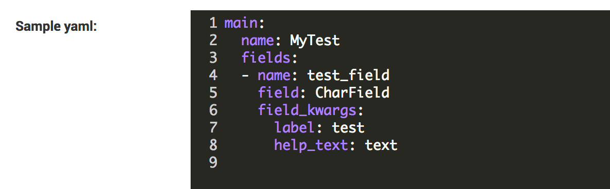
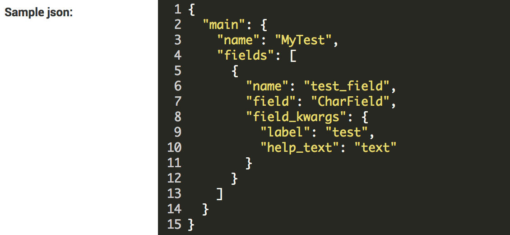
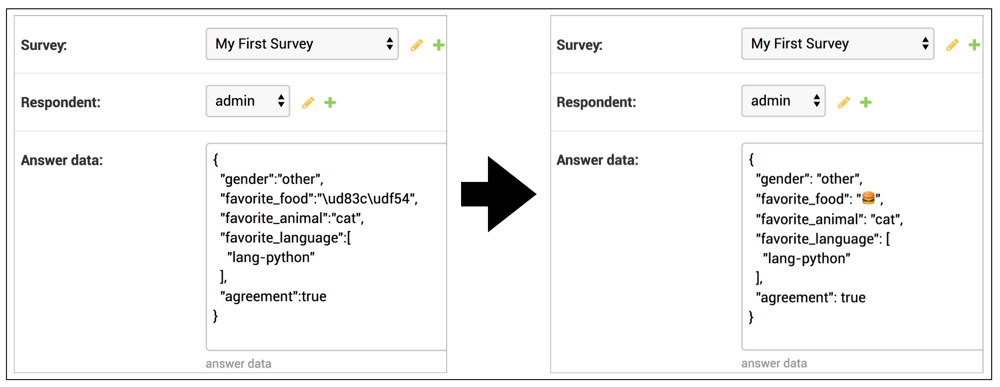
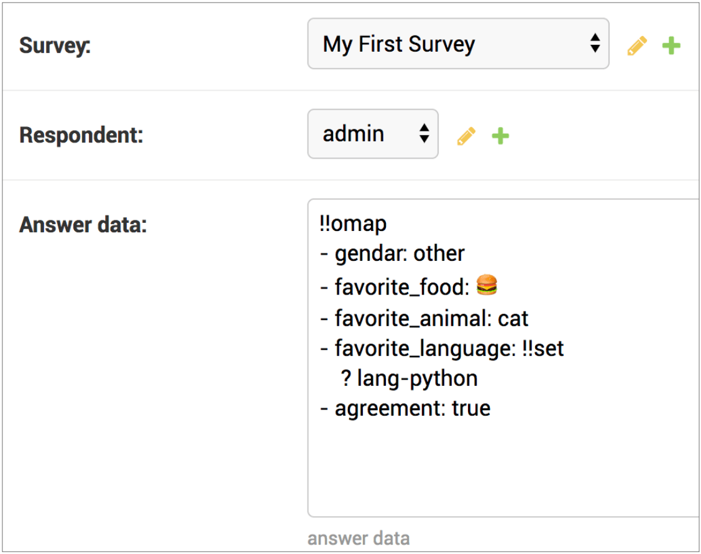

.. _`model_fields`:

==============================================================================
提供するモデルフィールドクラス
==============================================================================

definable-serializerではシリアライザーを記述するためのフィールドと、
ユーザーからの入力データを保存するためのフィールドを提供しています。

.. _`definable-serializer-fields`:

シリアライザーの定義を保存するモデルフィールド
~~~~~~~~~~~~~~~~~~~~~~~~~~~~~~~~~~~~~~~~~~~~~~~~~~~~~~~~~~~~~~~~~~~~~~~~~~~~~~

definable-serializerでは、JSON及びYAMLで記述された文字列及びファイルからシリアライザーを作ることができます。
特にadminサイトでシリアライザーを記述することで、デプロイの手間を緩和するのが目的です。
adminサイト上でテキストデータの編集を行うのは難しい話ではないものの、YAMLやJSON定義をハイライト無しで記述するのはちょっとした苦行です。

この問題を解決するために、CodeMirror2ウィジェットを利用してハイライトサポートを行う
2つのシリアライザー定義用のフィールドを用意しています。

.. _`definable_serializer_by_yaml_field_class`:

DefinableSerializerByYAMLField
++++++++++++++++++++++++++++++++++++++++++++++++++++++++++++++++++++++++++++++

.. class:: DefinableSerializerByYAMLField(*args, allow_validate_method=True, **kwargs)

DefinableSerializerByYAMLFieldは `https://github.com/datadesk/django-yamlfield <https://github.com/datadesk/django-yamlfield>`_ が
提供するYAMLFieldをラップし、CodeMirror2ウィジェットの利用及び非ASCII文字が正しく表示できるようにカスタマイズしています。

``allow_validate_method`` が ``False`` の場合、シリアライザーの定義中に ``validate_method`` が記述されていると ``ValidationError`` が発生します。

その他のオプションについては `https://github.com/datadesk/django-yamlfield <https://github.com/datadesk/django-yamlfield>`_ を参照してください。

以下に記述例を示します。

.. code-block:: python

    class Survey(models.Model):
        ..

        question = DefinableSerializerByYAMLField()

.. _`definable_serializer_by_json_field_class`:

DefinableSerializerByJSONField
++++++++++++++++++++++++++++++++++++++++++++++++++++++++++++++++++++++++++++++

.. class:: DefinableSerializerByJSONField(*args, allow_validate_method=True, **kwargs)

DefinableSerializerByJSONFieldは `https://github.com/dmkoch/django-jsonfield <https://github.com/dmkoch/django-jsonfield>`_ が
提供するJSONFieldをラップし、CodeMirror2ウィジェットの利用及び非ASCII文字が正しく表示できるようにカスタマイズしています。

``allow_validate_method`` が ``False`` の場合、シリアライザーの定義中に ``validate_method`` が記述されていると ``ValidationError`` が発生します。

その他のオプションについては  `https://github.com/dmkoch/django-jsonfield <https://github.com/dmkoch/django-jsonfield>`_ を参照してください。

以下に記述例を示します。

.. code-block:: python

    class Survey(models.Model):
        ..

        question = DefinableSerializerByJSONField()

------------------------------------------------------------------------------

.. _`methods-of-storing-input-data`:

ユーザーからの入力データを保存するモデルフィールド
~~~~~~~~~~~~~~~~~~~~~~~~~~~~~~~~~~~~~~~~~~~~~~~~~~~~~~~~~~~~~~~~~~~~~~~~~~~~~~

:ref:`storing-input-data` でも取り上げたように、モデルに結びつかないシリアライザーに入力されたデータを永続的に保存するには、
保存を担うモデルのフィールドにシリアライズ(直列化)された状態でデータを保存します。

ようはPythonのネイティブなデータをテキストやバイナリに変換してデータベースのカラムにさえ保存できればどんな形でも構いません。

definable-serializerではユーザーからの入力を保存するために2つのモデルフィールドを用意しています。

.. _`compat_json_field`:

JSONField
++++++++++++++++++++++++++++++++++++++++++++++++++++++++++++++++++++++++++++++

.. class:: JSONField(*args, **kwargs)

JSONは人気の高いシリアライズの形式です。しかし、Pythonに付属するjsonモジュールにはPythonのネイティブなデータ型である
``set型`` をシリアライズすることができません。

またensure_asciiの設定を行わないと非ASCII文字を "\\uXXXX" で表してしまうため、入力情報を確認する際に見苦しい状態になります。

definable-serializerでは、 `jsonfield <https://github.com/dmkoch/django-jsonfield>`_
が提供するJSONFieldをラップし、これらの問題を解消するコンパチビリティクラスを用意しています。

以下に使用例を示します。

.. code-block:: python

    from definable_serializer.models.compat import JSONField as CompatJSONField

    class Answer(models.Model):

        ..

        answer = CompatJSONField(
            verbose_name="answer data",
            help_text="answer data"
        )

このモデルフィールドを使うとadmin画面で以下のように表示されます。

    非ASCII文字列が正しく表示されます

.. _`compat_yaml_field`:

YAMLField
++++++++++++++++++++++++++++++++++++++++++++++++++++++++++++++++++++++++++++++

.. class:: YAMLField(*args, **kwargs)

YAMLはJSONと同様、テキストでデータをシリアライズします。記号が少なくインデントでデータ構造を表すため、Pythonのコードのように可読性に優れます。

definable-serializerでは、 django-yamlfield `(https://github.com/datadesk/django-yamlfield) <https://github.com/datadesk/django-yamlfield>`_
が提供するYAMLFieldをラップし、非ASCII文字が正しく表示されるコンパチビリティクラスを用意しています。

以下に使用例を示します。

.. code-block:: python

    from definable_serializer.models.compat import YAMLField as CompatYAMLField

    class Answer(models.Model):

        ..

        answer = CompatYAMLField(
            verbose_name="answer data",
            help_text="answer data"
        )

    非ASCII文字列が正しく表示されます
